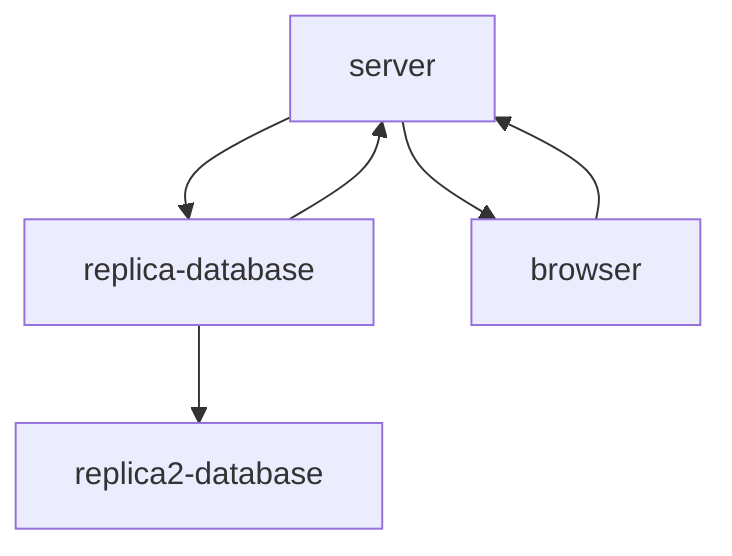
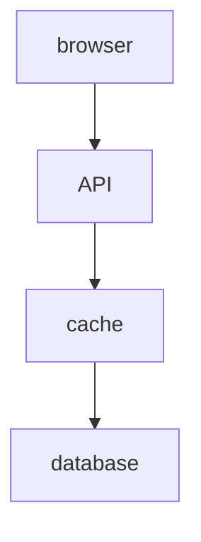
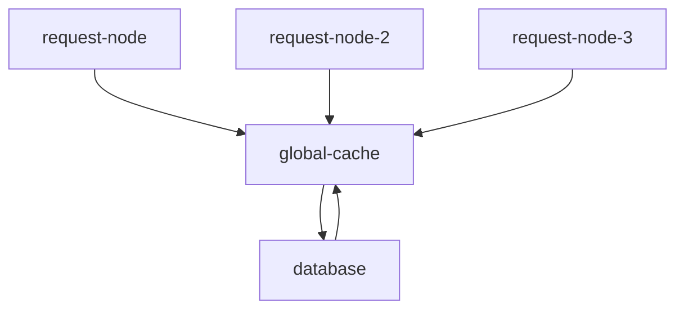
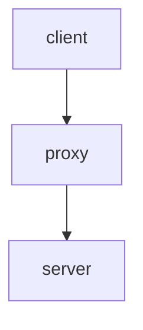
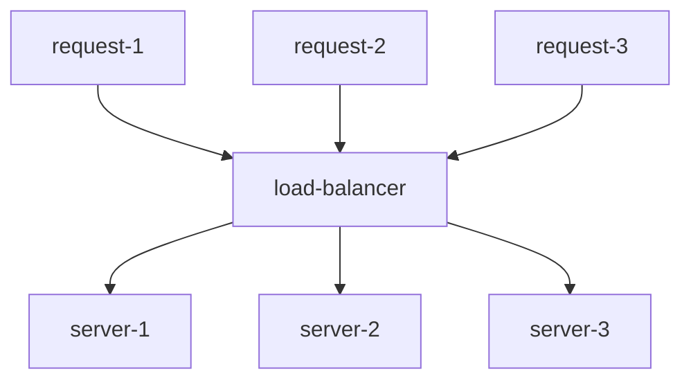
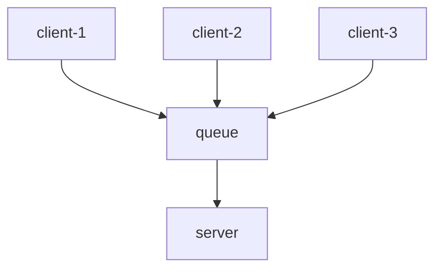
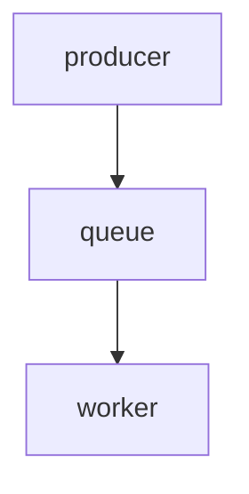
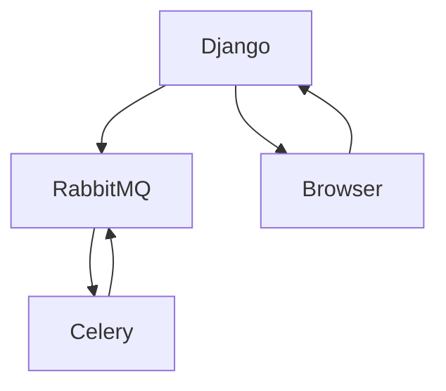
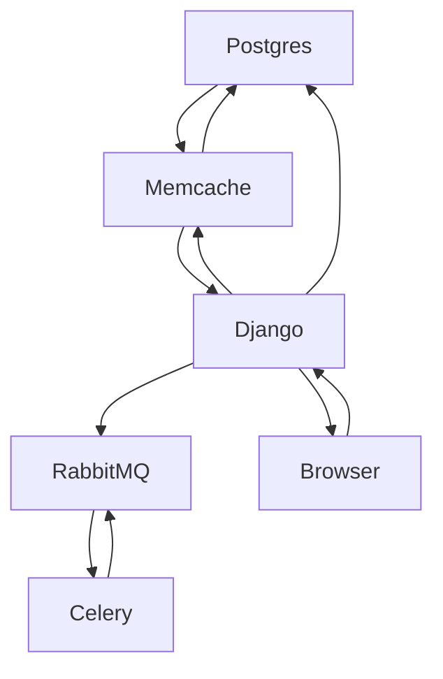

*version 1.1*: June 16 2023, added more detail, and diagrams
*version 1*: June 15 2023, initial release

### Intro
One of the most interesting parts about web development is web system architecture. I do not know why but when I hear people talking about a given architecture I get excited. My first exposure to architecture was a [talk](https://www.youtube.com/watch?v=hnpzNAPiC0E&t) by an Instagram engineer in which she spoke about how they scaled the infrastructure at Instagram. I found it interesting because she spoke about how to scale by using multicore programming and I liked how the components of the Instagram architecture interacted.

So, I naturally enjoyed my time reading `Scalable Web Architecture and Distributed Systems`, the first chapter in the book `The Architecture of Open Source Applications`.

In this essay I will try to summarize this chapter and share some of my thoughts about how I would design a social media application. And I am not an expert; I am just writing about this because its interesting and for learning purposes.

### Design Principles
According to the author of this chapter some key design decisions for building scalable web applications consist of:

Availability;
Performance;
Reliability; and
Scalability

A system is said to be *available* if it is always up and running. If a system is unavailable even for one minute the given company may lose thousands or even millions of dollars.

The availability of a system is achieved through *replication*. The purpose of replication is to enable the given system to continue operating despite failures; distributed systems hide partial failure by replicating servers for instance.

Replication is also implemented for reliability and performance; replicas are conducive to the reliability of a system because if one replica crashes other replicas can keep the system going; moreover, replicas are conducive to performance in two cases. Firstly, suppose you are scaling in size; that is, an increasing number of processes need to access data; by having two replicas you can serve more processes. Secondly, suppose you are scaling in a geographical area; by using replicas near the geographic location of your processes you decrease latency times.

The *performance* of a web system is another design principle; performance is important because performance affects the usage and user satisfaction as well as search engine rankings which correlate with revenue and retention. Performance can be defined as fast responses and low latency.

Another key design principle is *reliability*; as noted above one way to achieve reliability is through replicas. Reliability means that a given request will always get the same data in response and if the data changes the request will get new data.

Finally, another key design principle is *scalability*; scalability has to do with increasing the capability of your web system to handle more load.

### Core factors that are important for large web systems

Core factors crucial in the design of large web systems include *services*, *redundancy*, *sharding*, and *handling failure*.

The author of this chapter gives an example, namely, an image hosting website. One of the things we care about this is fast delivery when a user requests an image; other things to consider include:
            	- storage scalability: the application needs to have no limits as to how many images it can store
            	- low latency for image downloads/requests
            	- reliability: if a user uploads an image, the image needs to be there all the time
               - system needs to be easy to maintain
               - system needs to be cost effective
#### Services
Often it is important to decouple service into functions; consider the image hosting application above: it retrieves and uploads images through the network. If only one server handles these two functions there may be problems because writes are not asynchronous while reads are asynchronous; so during an upload the connection will be maintained and the client will be blocked– it will have to wait until the image gets written. So, in such cases it is beneficial to to decouple these two functions into their own services.

#### Redundancy 
If you only have one server then if something happens to this server the data will be lost; for example, the images in our image hosting application will be lost; so it is important to replicate the database in a different geographic location; for example:

#### Sharding
Suppose you have a tremendously large dataset that cannot fit in one server. You can either scale vertically whereby you use additional CPU cores, replace CPU with a faster CPU, add a bigger storage or you can scale horizontally whereby you add additional nodes – e.g., add a new server.

With respect to horizontal scaling one common technique is partitioning or sharding; for example, a given single file server can get replaced by multiple file servers each containing a set of images. One problem with this type of distribution of data  is data locality – i.e.,the closer the data to the operation the better the performance. Another problem with the distribution of data is inconsistency. When services share a resource there may be race conditions.

### How do you make web systems fast and scalable?
To make web systems fast and scalable you need to utilize caches, global caches, proxies, load balancers, and queues.

#### Caches
Caches exploit the locality of reference principle, namely, that that was requested recently it is likely to be requested again. If you place a cache in your request layer node then it will improve the performance of your API; when the user makes a request the API server will check if the data is in the cache; if it is not it will query the database; for example;

#### Global caches
Placing a global cache in your application means that multiple request nodes will use the same global cache. 

#### Proxy
A proxy acts as an intermediary – a client sends a request to the proxy and in turn the proxy relays this to the back-end servers. How can proxies get used to speed up service? Proxies enable *collapse forwarding* whereby same or similar requests get collapsed into one yielding only one response instead.

#### Load Balancers
Load balancers are also another key piece of a distributed system; a load balancer distributed load across different servers; suppose there are three requests coming in: Req 1, Req 2, and Req 3; the job of the load balancer is to send Req 1 to server 1, Req 2 to server 2 and Req 3 to server 3. Load balancers allow you to scale by handling more requests.

#### Queue
In a complex application writes take a long time. This when queues come in. Writes are not asynchronous - so when a client wants to write something to the database, the client gets blocked – i.e., it waits until the data has been written to start working again. By placing a queue in your architecture the requests get placed in a queue, and when it is placed here the client gets an acknowledgement and as a result it can keep working. In other words, when a server gets more requests than it handles the clients have to wait for other requests to get handled. Queues solve this issue.

### Lessons Learned

Suppose I am building a social media app; it would consist of a server, database, cache, queue, and a worker. A queue and a worker will enable asynchronous communication; for example, in a social media app when a user x gets a friend request from another user y, user x usually gets a notification via email. A queue and a worker work together to make this happen. A producer sends a message to a queue and the worker processes this message; the first message that gets into the queue, it is the first message that the worker processes. Here is a depiction of the produce, queue, and worker interaction:

Technically, we need a message broker that manages the queue and translates requests into a messaging protocol. For this we can choose `celery`, and `RabbitMQ`; celery workers will listen to the message broker to get new messages to process for asynchronous tasks. Suppose we use Django as the server then we have:

We can then use `memcache` as our cache layer to speed up the API. Once we have this the architecture looks like this:

